Authored by:  
Roie Ben-haim (Twitter: @roie9876)   
Oren Penso (Twitter: @openso)

<!-- /wp:paragraph -->

<!-- wp:paragraph -->

Recently in an internal discussion we’ve had about the value of microservices architecture some questions were raised about the value but also the challenges microservices brings.  
In this blog post we will try to answer these questions and others.

<!-- /wp:paragraph -->

<!-- wp:heading -->

## **_Application Architecture is Changing_** 

<!-- /wp:heading -->

<!-- wp:paragraph -->

Application Architectures are ever changing. Over the past few years, the application space has evolved from monolithic to microservices architecture, though monolithic application are still the majority of apps out there the adoption of microservices architecture is fast growing.

<!-- /wp:paragraph -->

<!-- wp:image {"id":2035} -->

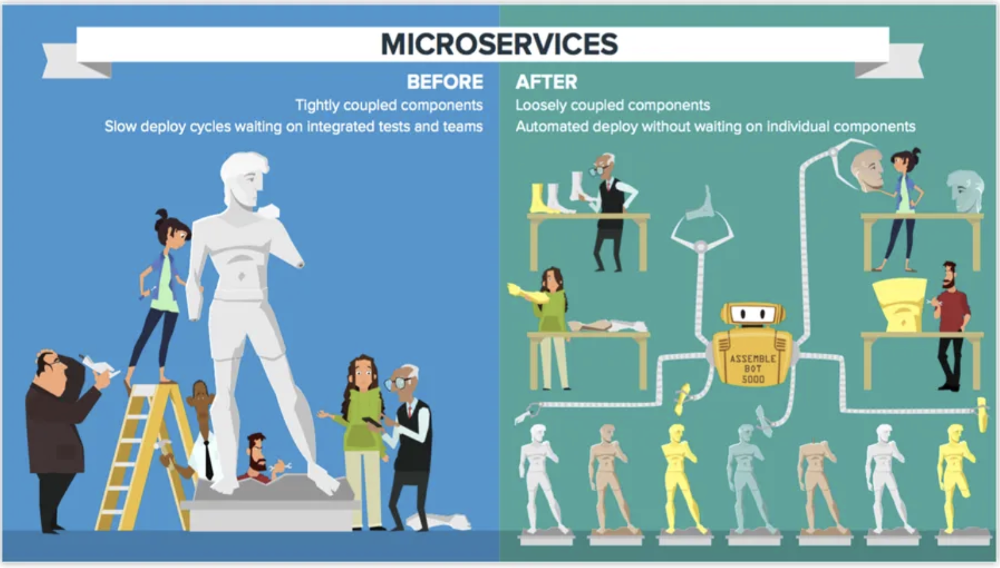

<!-- /wp:image -->

<!-- wp:paragraph -->

This change is driven from the need for speed. companies are under constant pressure to innovate faster and provide business value to be able to compete in a very competitive market. Some call this “Digital transformation” and no market vertical is exempt of taking this transformation.

<!-- /wp:paragraph -->

<!-- wp:paragraph -->

Most of this innovation is done in  
software, and enterprise businesses hire a growing number of developers to transform  
innovative ideas into a reality.

<!-- /wp:paragraph -->

<!-- wp:paragraph -->

From a software development point of view, in a monolithic app,  
all components that compile the application are packaged and tested as a single  
unit. If for exmaple, the UI team needs  
to make a small change in the code, that small change can have a ripple effect  
where the entire application stack would need to be redeployed.

<!-- /wp:paragraph -->

<!-- wp:paragraph -->

In a microservices architecture, the  
application functionality is broken into smaller pieces. Now, each part of the  
code is running independently from other pieces and may even be developed by separate teams and in multiple languages. These  
microservices communicate with each other using a language-agnostic APIs (e.g. REST).

The host that runs a microservice can be a VM, but **_containers_**  
have evolved as the preferred packaging unit for microservices due to their  
small footprint, quick startup times and easy creation process. Combining the  
concepts of microservices with the  
benefits of containers enables companies to easily deploy, upgrade, patch and  
decommission parts of their application quickly and independently.

<!-- /wp:paragraph -->

<!-- wp:image {"id":2016} -->

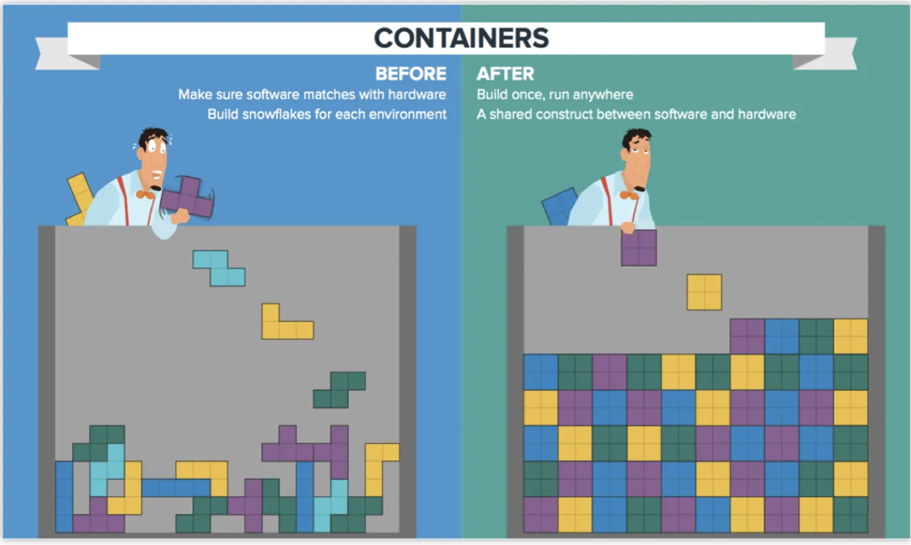

<!-- /wp:image -->

<!-- wp:paragraph -->

The change to microservices is  
affecting not only the technology stack but provide real benefit to the organizational  
and cultural aspects of the business. You can read more in this excellent blog  
from our colleague Oded Shopen:

<!-- /wp:paragraph -->

<!-- wp:paragraph -->

[https://medium.com/@odedia/microservices-are-for-humans-not-machines-721a6a56344f](https://medium.com/@odedia/microservices-are-for-humans-not-machines-721a6a56344f)

<!-- /wp:paragraph -->

<!-- wp:heading -->

## **_Great innovation requires great responsibility_**

<!-- /wp:heading -->

<!-- wp:paragraph -->

While the change from monolithic apps development to microservices architecture bring significant value in terms of agility and speed, it also introduces a new complexity.

<!-- /wp:paragraph -->

<!-- wp:image {"id":2021} -->

<!-- /wp:image -->

<!-- wp:paragraph -->

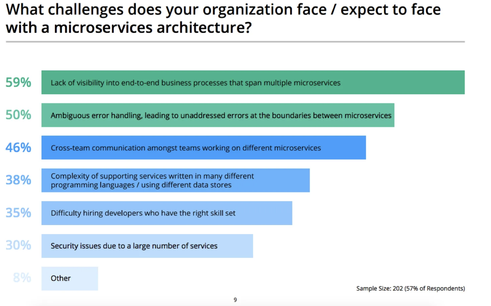

<!-- /wp:paragraph -->

<!-- wp:paragraph -->

As you can see from the survey  
above, there are several challenges regarding the behavior of microservices and  
the implementation of the architecture in a production  
environment.

<!-- /wp:paragraph -->

<!-- wp:paragraph -->

Most of the challenges stem from the fundamental change to a distributed architecture where your code is now spread over the multiple processes. Service mesh and the eco system around it provides an answer for some of these major challenges.

<!-- /wp:paragraph -->

<!-- wp:heading -->

## **_The answer is Service mesh_**

<!-- /wp:heading -->

<!-- wp:paragraph -->

A Service mesh (SM) is an abstraction layer for the network in a microservices architecture. In his blog post, Niran Even Chen compared the service mesh to some kind of virtualization and by that helped to better understand the value:  
[http://cloud-abstract.com/service-mesh-is-just-another-form-of-virtualization/](http://cloud-abstract.com/service-mesh-is-just-another-form-of-virtualization/)

<!-- /wp:paragraph -->

<!-- wp:paragraph -->

The abstraction “magic” of the service mesh is realized through its data plane component called the proxy. The proxy runs as a container inside the K8S Pod (referred to also as a “Sidecar”).&nbsp; All communication in and out of the Pod is done through the service mesh’s proxy, and therefore control of the Pod’s communication is delegated to the proxy. &nbsp; In the picture below, we can see an example of a service running within a Pod and SM (Service mesh) Proxy sharing a Pod, any traffic directed or originated by service A will go through the SM proxy.

<!-- /wp:paragraph -->

<!-- wp:image {"id":2023} -->

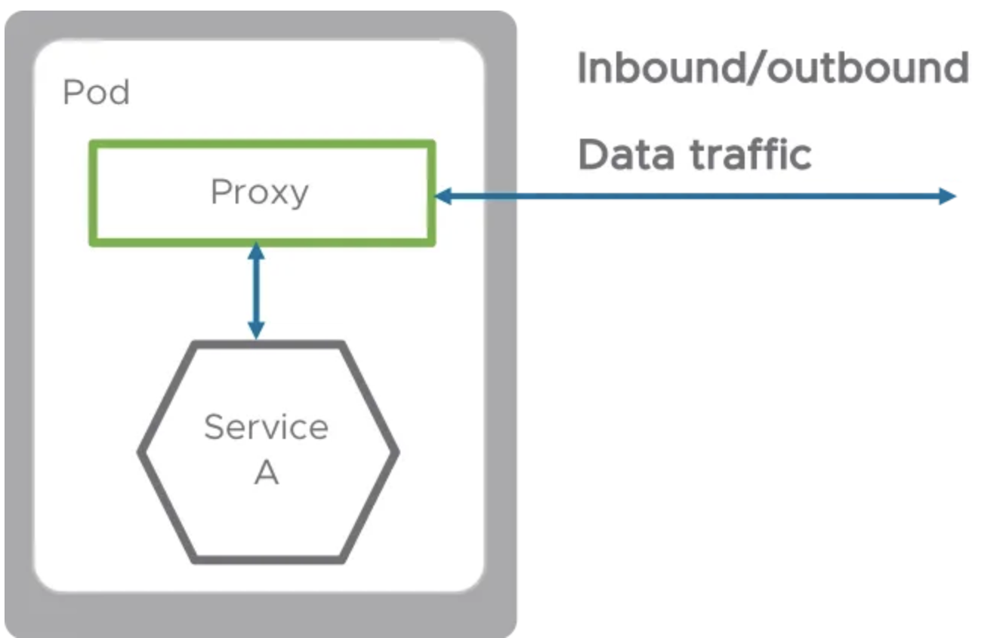

<!-- /wp:image -->

<!-- wp:paragraph -->

When we expand the mesh with additional services, every service will have a proxy inside the same  
Pod. All “service to service”  
communication passes through the proxy, so the  
entire traffic is managed by the service mesh.

In the image below, service A communicates with service B via a proxy.

<!-- /wp:paragraph -->

<!-- wp:image {"id":2024} -->

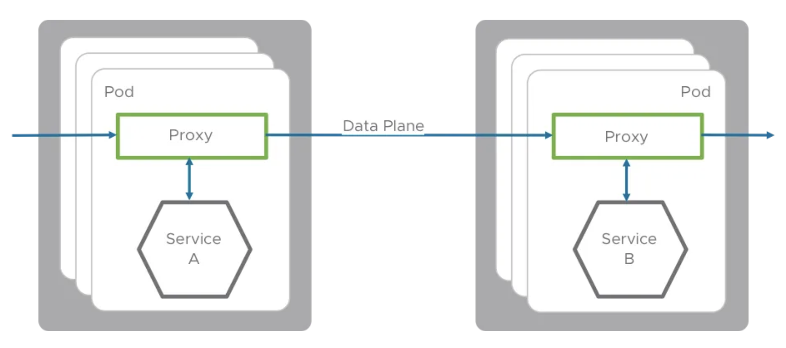

<!-- /wp:image -->

<!-- wp:paragraph -->

As mentioned before, the traffic flows between the  
proxies, that's the data plane traffic of SM.

<!-- /wp:paragraph -->

<!-- wp:paragraph -->

The leading open source project  
for SM proxy is Envoy.

<!-- /wp:paragraph -->

<!-- wp:paragraph -->

Envoy: [https://www.envoyproxy.io/](https://www.envoyproxy.io/)

<!-- /wp:paragraph -->

<!-- wp:paragraph -->

Envoy is a CNCF mature project by itself  
and is used in solutions like Istio but also PCF and many other solutions who  
make use of Envoy.

<!-- /wp:paragraph -->

<!-- wp:paragraph -->

The proxy provides many features:

<!-- /wp:paragraph -->

<!-- wp:list -->

- Dynamic service discovery
- Layer 7 Load balancing
- TLS termination
- HTTP/2 and gRPC proxies
- Circuit breakers
- Health checks
- Staged rollouts with %-based traffic split
- Fault injection
- Rich metrics

<!-- /wp:list -->

<!-- wp:paragraph -->

The question now is, where is the policy that  
controls the proxy’s behavior created and implemented?

<!-- /wp:paragraph -->

<!-- wp:heading -->

## **_Service mesh Control Plane_**

<!-- /wp:heading -->

<!-- wp:paragraph -->

The Service mesh  
control plane core components are:

<!-- /wp:paragraph -->

<!-- wp:list -->

- Config (Pilot in Istio)
- Policy (Mixer in Istio)
- Certs (Citadel in Istio)

<!-- /wp:list -->

<!-- wp:paragraph -->

In the following diagram we can see the separation of the control plane from the data plane.

<!-- /wp:paragraph -->

<!-- wp:paragraph -->

**_Config_**  
The config component is responsible for the configuration of traffic rules in the proxy, the config converts the policy created by the DevOps team to traffic rules. The config component is also responsible for service discovery in the mesh (detected by the proxy)

<!-- /wp:paragraph -->

<!-- wp:paragraph -->

**_Policy_**  
The policy component enforces access control and usage across the Service mesh, it’s also responsible for collecting telemetry data from the proxy.

<!-- /wp:paragraph -->

<!-- wp:paragraph -->

**_Certs_**   
The cert component (Certificate authority server) generates certificates for each proxy in the mesh, by providing certificates to the proxies in the mesh we can encrypt the “service to service” traffic. Another key functionality of certs is user authentication mechanism.

<!-- /wp:paragraph -->

<!-- wp:paragraph -->

<!-- /wp:paragraph -->

<!-- wp:image {"id":2026} -->

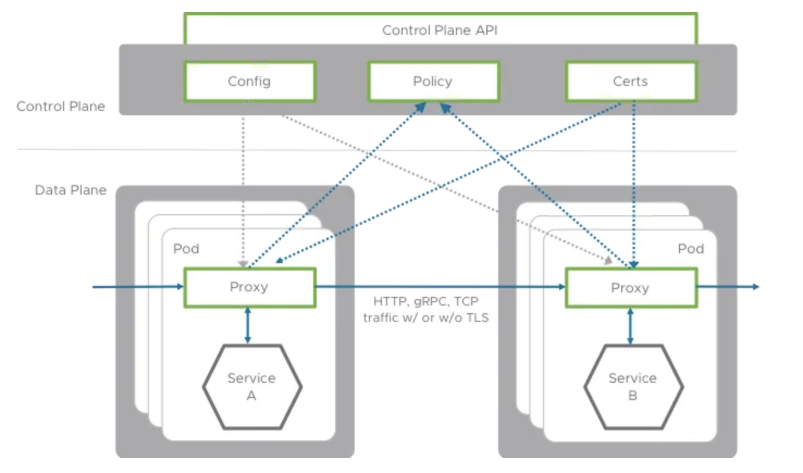

<!-- /wp:image -->

<!-- wp:heading -->

## **_Connecting the dots in microservices – Application Resiliency_** 

<!-- /wp:heading -->

<!-- wp:paragraph -->

In a monolithic architecture, communications between different methods\functions\processes happen in the same server as in-memory calls. The move to microservices architecture replaced the in-memory calls with network calls.

<!-- /wp:paragraph -->

<!-- wp:image {"id":2020} -->

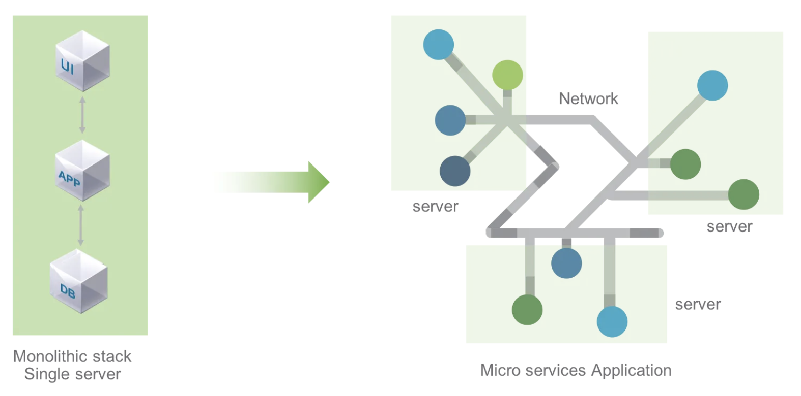

<!-- /wp:image -->

<!-- wp:paragraph -->

This change brings new challenges related the communication between microservices. Developers in a monolithic architecture do not need to deal with latency between two processes running on the same server, but with microservices, network latency becomes a concern. A high latency can now cause failure in a service response. Scenarios such as timeouts between microservices, circuit breakers or fault response needs to be handled in code at the application layer, or at the platform level. For the application stack, we can achieve it using frameworks such as :

<!-- /wp:paragraph -->

<!-- wp:paragraph -->

[Netflix OSS](https://github.com/Netflix).

<!-- /wp:paragraph -->

<!-- wp:paragraph -->

Some of the Netflix OSS services are  
described in the following list:

<!-- /wp:paragraph -->

<!-- wp:paragraph -->

[Hystrix](https://github.com/Netflix/hystrix): Latency and fault tolerance library.&nbsp;  
[Zuul](https://github.com/Netflix/zuul): &nbsp; Edge service that provides dynamic routing, monitoring, resiliency,   
 security  
[Ribbon](https://github.com/Netflix/ribbon): Client-side l&nbsp; oad Balancing  
[Eureka](https://github.com/Netflix/eureka): &nbsp;Service discovery

<!-- /wp:paragraph -->

<!-- wp:image {"id":2015} -->

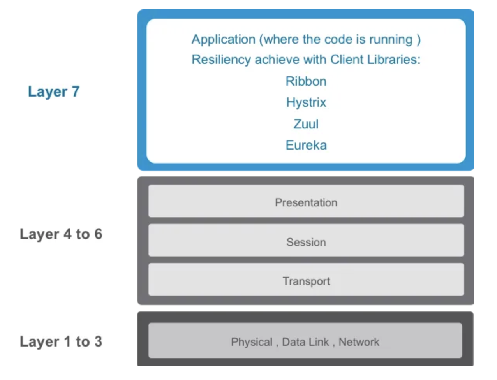

<!-- /wp:image -->

<!-- wp:paragraph -->

Keep in  
mind that the answer here isn’t the same for all languages. The client library  
depends on the language the code it is written  
in. &nbsp;For example, Netflix OSS and Spring  
Cloud are designed specifically for Java. If  
your application is written in Python you will need a different solution.

<!-- /wp:paragraph -->

<!-- wp:heading -->

## **Application Resiliency with Service Mesh**

<!-- /wp:heading -->

<!-- wp:paragraph -->

The microservice architecture does not solve the challenge of application  
resiliency, it amplifies the challenge  
because now the developer is supposed to solve it with logic in each  
microservice independently.

In the picture below,  
we see three microservices. Two  
microservices are running a java application so  
for that we can apply the Netflix OSS as their client libraries but the third  
microservice runs a python application. Which client libraries can we run  
there?

<!-- /wp:paragraph -->

<!-- wp:image {"id":2014} -->

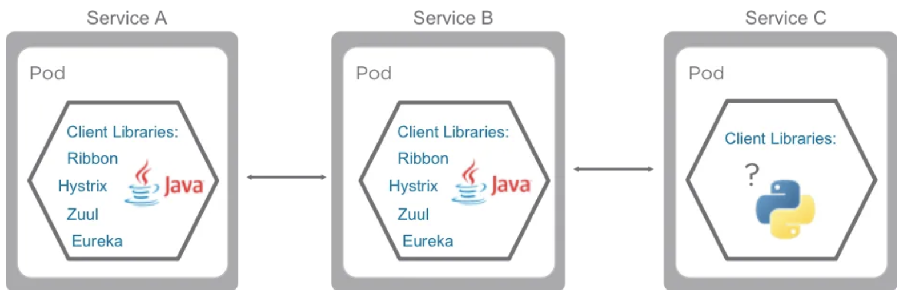

<!-- /wp:image -->

<!-- wp:paragraph -->

To make things more complicated, microservices  
by definition are **_polyglot_** _,_ meaning each microservice can  
be written in a different language. We need to solve the resiliency challenge  
for each coding language with its own frameworks/libraries, which adds to the  
inconsistency in the development process. So microservices may result in more languages  
to support, and more services to monitor.

<!-- /wp:paragraph -->

<!-- wp:paragraph -->

Service mesh enables us to offload application resiliency  
functionality from the code to the SM data plane (proxy). The implementation of  
the resiliency can be done in the proxy to untangle the dependency from the coding  
language running at the microservice container itself. Since the proxy runs as a separate container (sidecar) inside the Pod,  
it is agnostic to other containers running in the same Pod.

The implementation  
of the resiliency inside the proxy is not Netflix OSS but the functionality is similar.

<!-- /wp:paragraph -->

<!-- wp:image {"id":2022} -->

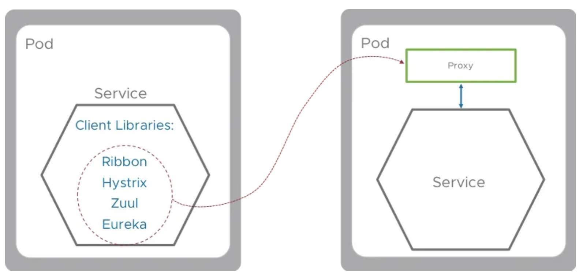

<!-- /wp:image -->

<!-- wp:paragraph -->

When we move the service resiliency functionality to the proxy we decouple it from the coding language, as you can see this allows us to run python application in service B and Service C with different code languages, that’s one of the key values of the SM proxy.

<!-- /wp:paragraph -->

<!-- wp:image {"id":2013} -->

<!-- /wp:image -->

<!-- wp:heading -->

## **_Traffic management_** 

<!-- /wp:heading -->

<!-- wp:paragraph -->

To better understand the value of SM for traffic management we will review the effort needed to create and push a new version of an application to production.

<!-- /wp:paragraph -->

<!-- wp:paragraph -->

In a monolithic architecture it’s relatively  
easy to address a single application since it’s a single stack, all we need to do  
is re-build the entire stack’s components and deploy it with the new version. The  
downside is that it is also true if we need  
to make a small change in our code. We will still need to test and push a huge  
monolithic block.

The image shown below describes single monolithic app in version 1 and the same app in version 2. With  
a load balancer we can divert user traffic (can be subset or 100% traffic)  
coming from the users to version 2 of the apps.

<!-- /wp:paragraph -->

<!-- wp:image {"id":2031} -->

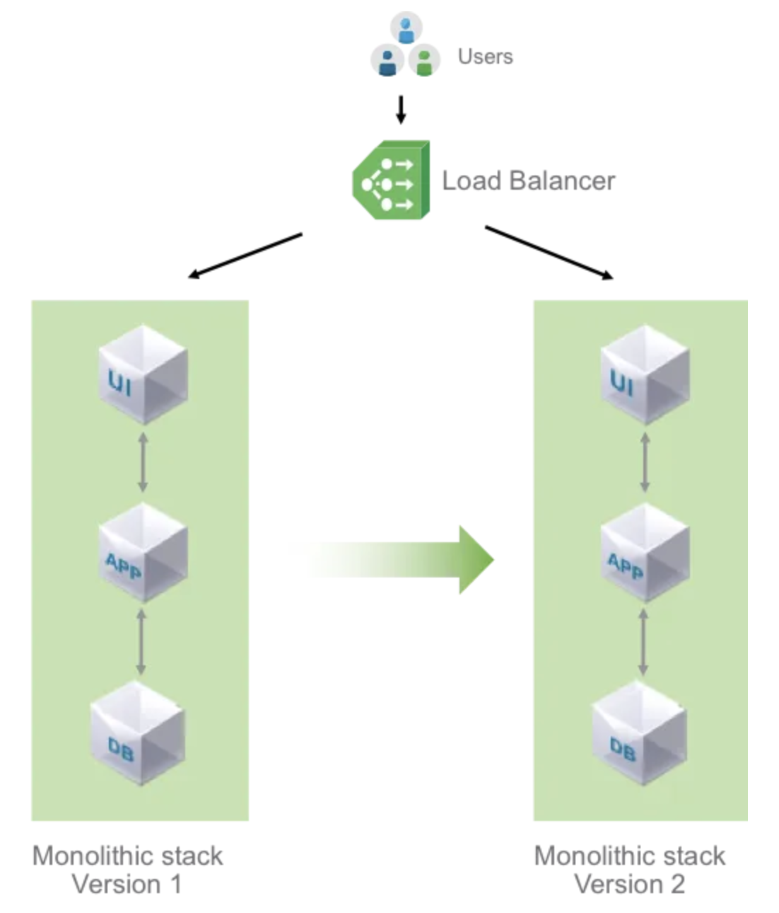

<!-- /wp:image -->

<!-- wp:paragraph -->

As mentioned before, the drawback of this approach is that we can’t really perform a partial deploy of an app, we need to deploy the entire application stack and test it as a single monolith. This is one primary reason the industry decided to move to microservices. Microservices allows us to update each part of a business app independently from others due to their loosely coupled architecture.

<!-- /wp:paragraph -->

<!-- wp:paragraph -->

In the image shown below service A communicates  
with service B. Service B is built from 3  
pods. By default,  
K8S will split the traffic between all 3 Pod’s equally, so each Pod will get 33%  
of traffic.

<!-- /wp:paragraph -->

<!-- wp:image {"id":2028} -->

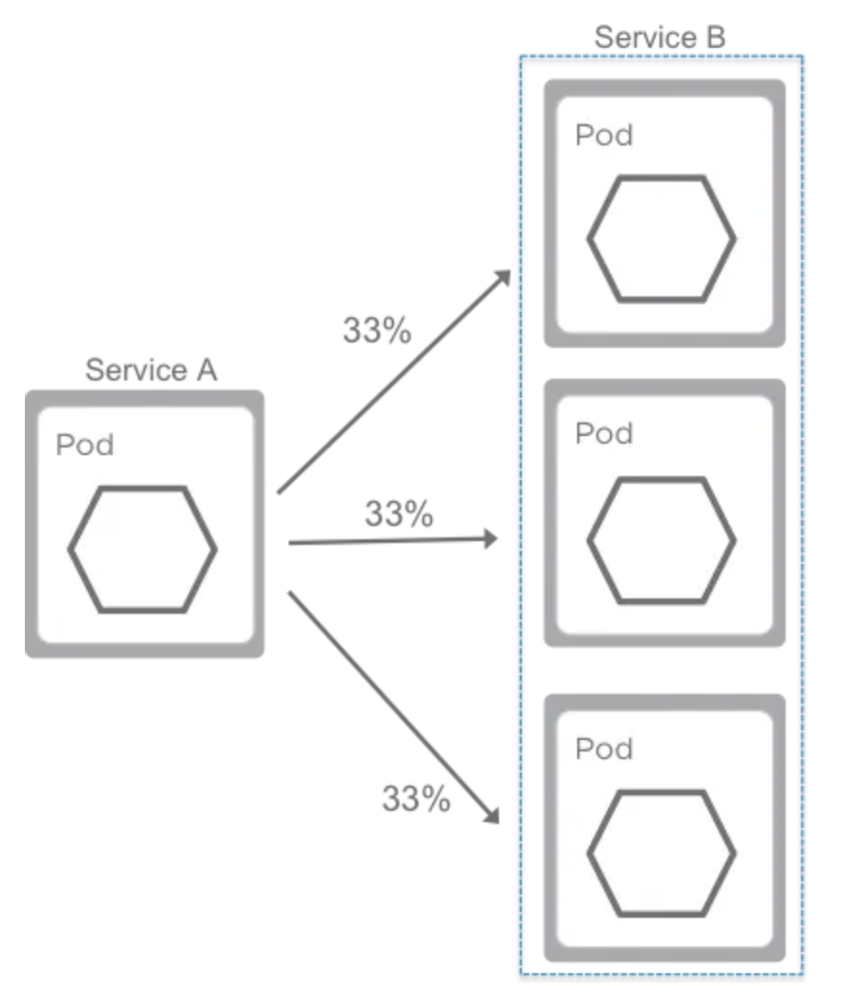

<!-- /wp:image -->

<!-- wp:paragraph -->

Let’s assume we need to update the code  
in service B, we want to create other versions of this microservice (we’ll call  
it v2) and steer the traffic between the two microservices in a “canary upgrade”  
\* fashion.

<!-- /wp:paragraph -->

<!-- wp:paragraph -->

\*Canary process upgrade - canary  
refers to a process when a whole lot of servers\services are going to be upgraded and  
you want to check the upgrade and code are solid. In that process we will first try to upgrade a small  
number of servers\services (usually 1), the “canary”, and only if that is successful will the remaining's. The origin  
of the term “canary” in the [Link](https://www.smithsonianmag.com/smart-news/story-real-canary-coal-mine-180961570/).)

<!-- /wp:paragraph -->

<!-- wp:paragraph -->

Following the image shown below, service A communicates with  
service B,

<!-- /wp:paragraph -->

<!-- wp:paragraph -->

we would like to steer the traffic  
to the new version of microservice B but we  
don’t want to steer 25% of all traffic. We  
want to use canary upgrade and test it  
first with small portion of the traffic (let’s say 1%) and even control who is the exact  
user that hit our v2 by L7 parameters like:  
username, browser type and other L7  
attributes.&nbsp;

<!-- /wp:paragraph -->

<!-- wp:paragraph -->

With K8s we can’t achieve this  
goal.

<!-- /wp:paragraph -->

<!-- wp:image {"id":2029} -->

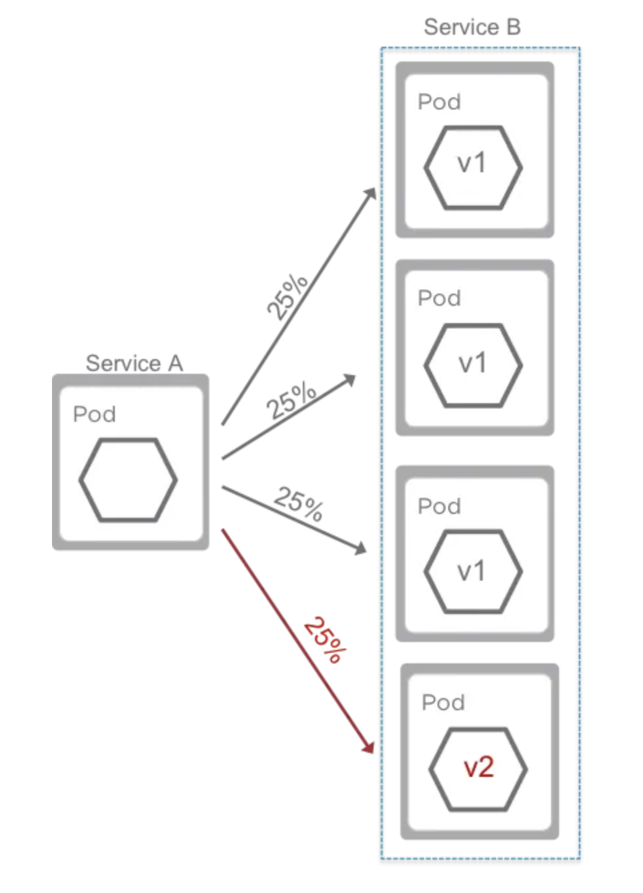

<!-- /wp:image -->

<!-- wp:heading -->

## **_Steering traffic in L7_**

<!-- /wp:heading -->

<!-- wp:paragraph -->

Due to the basic fact that all the traffic  
passes through the proxy, &nbsp;that has  
the ability to control traffic on layer 7 (Application layer), we can steer  
the traffic based on L7 attributes and separate it between microservices as we  
pleased.

For example, we can steer a  
percent of the overall based on the user identity or event browser type.

<!-- /wp:paragraph -->

<!-- wp:image {"id":2030} -->

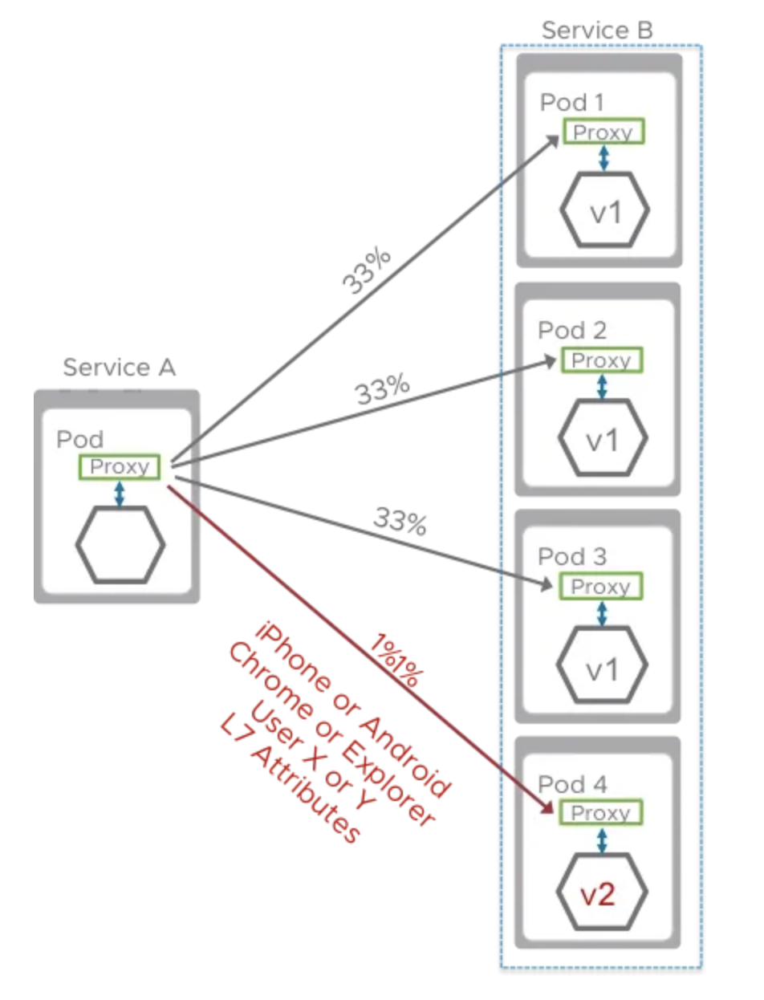

<!-- /wp:image -->

<!-- wp:heading -->

## **_What about security?_**

<!-- /wp:heading -->

<!-- wp:paragraph -->

Another key aspect that needs to be addressed  
when we move from the monolithic to the microservice is security and confidentiality.

<!-- /wp:paragraph -->

<!-- wp:paragraph -->

As shown in the image below, in the monolithic world we didn’t need  
to take care of encrypting traffic passing between different process on the  
same server, when we move to the microservice world this traffic is now passing  
over the wire, this can expose us to a “[man in the middle  
attack](https://en.wikipedia.org/wiki/Man-in-the-middle_attack)”.

<!-- /wp:paragraph -->

<!-- wp:image {"id":2025} -->

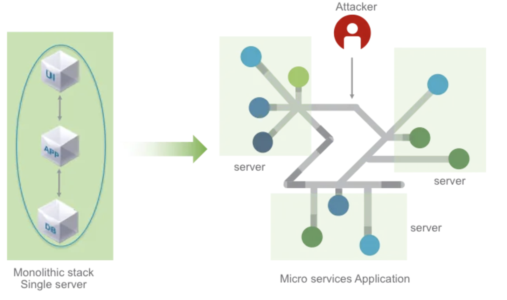

<!-- /wp:image -->

<!-- wp:paragraph -->

encrypt service to service

<!-- /wp:paragraph -->

<!-- wp:paragraph -->

The network between microservices in  
a kubernetes based container orchestration is by default not encrypted nor  
firewalled, controlled or managed in any way.

<!-- /wp:paragraph -->

<!-- wp:paragraph -->

We  
will address the challenge of connecting the microservices and manage the  
underlay networking and security in other blog posts describing the  
VMware offering around network and security.

<!-- /wp:paragraph -->

<!-- wp:paragraph -->

In Service mesh perspective, we can  
address the challenge mentioned above on L7 with the encryption on the traffic  
between microservices.

<!-- /wp:paragraph -->

<!-- wp:paragraph -->

Back to the problem in the traditional  
infrastructure, to solve it we had to insert a digital certificate to each application  
and maybe change the way the application communicates with other applications, that  
also demanded us to update the certificates and manage them along the time.

<!-- /wp:paragraph -->

<!-- wp:paragraph -->

The abstraction of that problem  
with Service mesh allows us yet again to solve the problem centrally with the Service mesh infrastructure  
without affecting the code and without any relevance to the language or purpose  
of the microservice.

<!-- /wp:paragraph -->

<!-- wp:paragraph -->

There is a component in the SM control  
plane called **_Certs_** that allows us to issue certificates to each proxy  
on the mesh. Encrypting the traffic between proxy’s allows us to solve the  
problem in the infrastructure level and not worry about the change of code or  
the basic container image of the microservice. As mentioned before the entire  
traffic of the Pod is directed through the proxy, so we ensure that the entire traffic is encrypted and secured.

<!-- /wp:paragraph -->

<!-- wp:paragraph -->

The management is centralized and  
in infrastructure perspective, so it won't  
affect the code or the behavior of the application in any way, and that’s the key point: abstraction.

<!-- /wp:paragraph -->

<!-- wp:image {"id":2027} -->

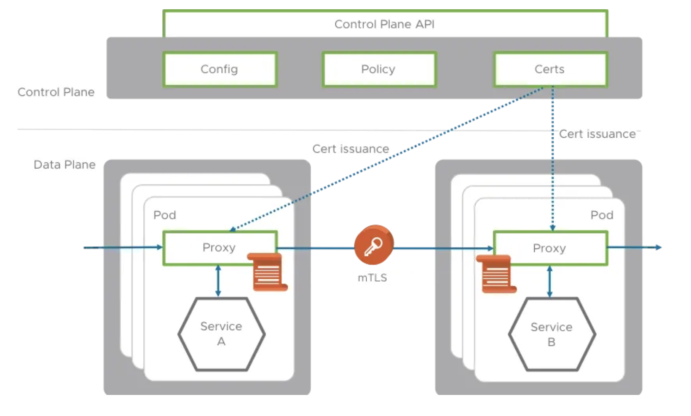

<!-- /wp:image -->

<!-- wp:heading -->

## **_Application insight and user experience_**

<!-- /wp:heading -->

<!-- wp:paragraph -->

Tracing  
is our ability to understand and visualize how a single transaction span  
between different components in our application with a time line graph. We use the tracing  
ability to find bottlenecks and performance issues between the microservices  
inside our application.

<!-- /wp:paragraph -->

<!-- wp:paragraph -->

Transaction tracing on monolithic architecture was very easy  
compared to tracing distribute system such as microservices. in distributed  
services a single user request can translate to a series of RestAPI Calles  
between different microservices, this is where the real challenge begins,  
because of the relationship between the different microservices and&nbsp; the complexity of the bonds between them we  
don’t really know where the transaction starts and where it ends.

<!-- /wp:paragraph -->

<!-- wp:paragraph -->

This is an example of tracing  
one request translated to five different API calls between different microservices.  
The trace shows a set of spans and describes  
the different microservices involved in the request by the request tag and with  
a corresponding timeline.

<!-- /wp:paragraph -->

<!-- wp:paragraph -->

As  
you can see the begin of the request, for example, was microservice A which triggered  
action on microservice B etc. on the  
example, microservice E start only after B and D finish.

<!-- /wp:paragraph -->

<!-- wp:paragraph -->

For  
each span we can see the start point with time  
and end point with time, with this info we can understand the latency per span.  
With that info, we can troubleshoot the  
chock point.

<!-- /wp:paragraph -->

<!-- wp:image {"id":2018} -->

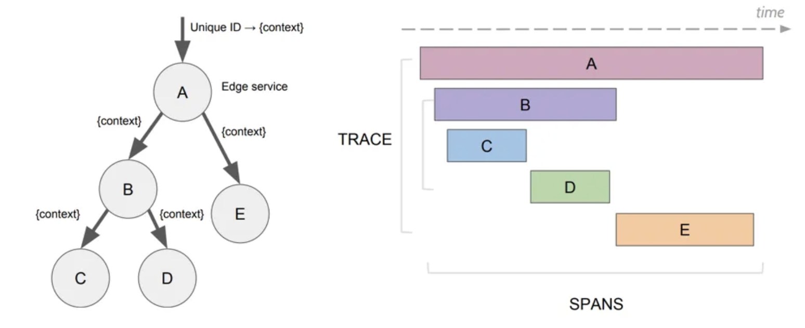

<!-- /wp:image -->

<!-- wp:paragraph -->

Source  
of image:

<!-- /wp:paragraph -->

<!-- wp:paragraph -->

[https://cdn.oreillystatic.com/en/assets/1/event/262/From%20zero%20to%20distributed%20traces\_%20An%20OpenTracing%20tutorial%20Presentation.pdf](https://cdn.oreillystatic.com/en/assets/1/event/262/From%20zero%20to%20distributed%20traces_%20An%20OpenTracing%20tutorial%20Presentation.pdf)

<!-- /wp:paragraph -->

<!-- wp:paragraph -->

now try to do trace transactions in applications built from thousands of microservices?   
The images below illustrates the complexity of the relations between microservice in Amazon and Netflix. as you can imagine tracing transactions in this environment can describe as mission impossible. &nbsp;&nbsp;&nbsp;&nbsp;&nbsp;&nbsp;&nbsp;&nbsp;&nbsp;&nbsp;&nbsp;&nbsp;&nbsp;&nbsp;&nbsp;&nbsp;&nbsp;&nbsp;&nbsp;&nbsp;&nbsp;&nbsp;&nbsp;&nbsp;&nbsp;&nbsp;&nbsp;&nbsp;&nbsp;&nbsp;&nbsp;&nbsp;&nbsp;&nbsp;&nbsp;&nbsp;&nbsp;&nbsp;&nbsp;&nbsp;&nbsp;&nbsp;&nbsp;&nbsp;&nbsp;&nbsp;&nbsp;&nbsp;&nbsp;&nbsp;&nbsp;&nbsp;&nbsp;

<!-- /wp:paragraph -->

<!-- wp:image {"id":2012} -->

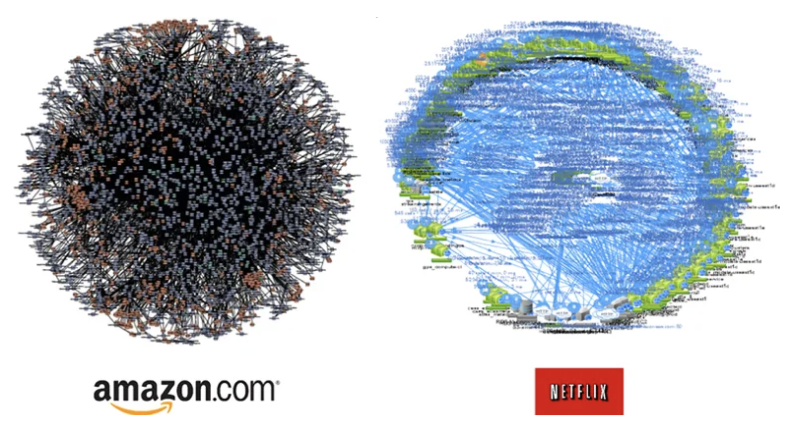

<!-- /wp:image -->

<!-- wp:paragraph -->

To help us to monitor the transactions and get the tracing info we need there is some tools called client libraries. The installation of those libraries was according to the language the code is written in.

Most of the time when developing Monolithic applications, we use a single language so installing the right library isn't an issue and its relatively easy. When we move to microservices architecture and with that diversity of development languages we need different libraries for different microservices with different data formats witch lead to polyglot microservice.

<!-- /wp:paragraph -->

<!-- wp:paragraph -->

More on the challenge of tracing a  
polyglot services is described in the  
solutions that address the challenge, for  
example, a very known tool is Jaeger:

<!-- /wp:paragraph -->

<!-- wp:paragraph -->

[https://www.jaegertracing.io/docs/1.8/client-libraries/](https://www.jaegertracing.io/docs/1.8/client-libraries/)

<!-- /wp:paragraph -->

<!-- wp:paragraph -->

There is a list of the supported  
libraries by the language of code:

<!-- /wp:paragraph -->

<!-- wp:paragraph -->

[https://www.jaegertracing.io/docs/1.8/client-features/](https://www.jaegertracing.io/docs/1.8/client-features/) the table shows that each client libraries provide different capability and feature sets that depend on the language of code we are using.

<!-- /wp:paragraph -->

<!-- wp:paragraph -->

Let’s take for example application built from two microservice developed in NodeJS and Python, to be able to get any tracing info we need to install Jager for NodeJS and Jager for Python on each microservice, after that effort we may still get inconsistency tracing data results.

<!-- /wp:paragraph -->

<!-- wp:image {"id":2019} -->

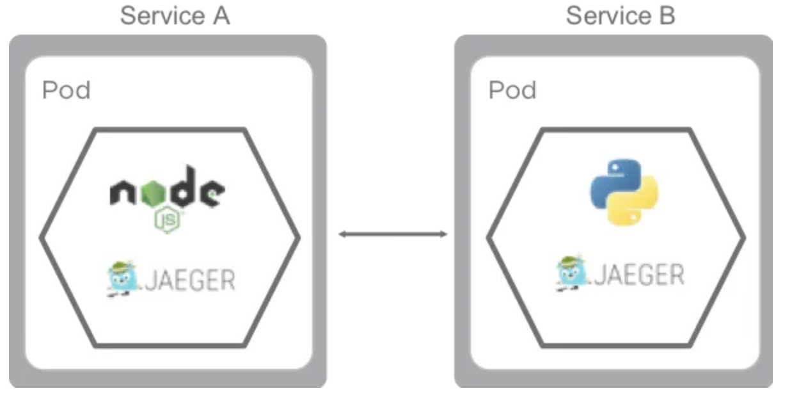

<!-- /wp:image -->

<!-- wp:paragraph -->

Again, the ultimate answer is an abstraction and the use of Service mesh data plane and control plane as the surface to do so. Once we use the proxy as the tracing point for all the traffic going in and out of the POD we can be abstracted to the code of the microservice running on the container a long side the proxy. The trace is being achieved on the infrastructure level for all the microservices that takes part in the mesh without the bother of addressing different runtimes, different languages and diversity of tool

<!-- /wp:paragraph -->

<!-- wp:image {"id":2017} -->

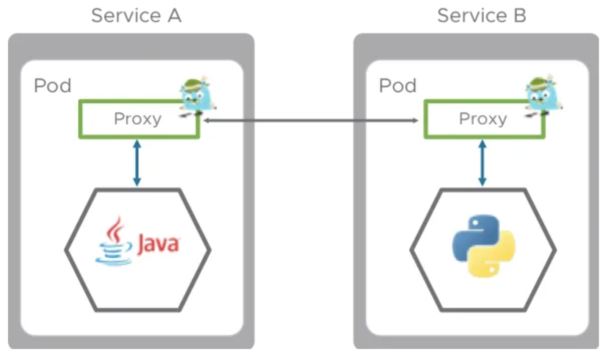

<!-- /wp:image -->

<!-- wp:heading -->

## **Summary**

<!-- /wp:heading -->

<!-- wp:paragraph -->

In this blog, we tried to illustrate what Service mesh is and explain what value  
it brings.

<!-- /wp:paragraph -->

<!-- wp:paragraph -->

There are a lot of benefits in moving to microservices architecture but with that  
there are a lot of new challenges. Most  
of the challenges can be overcome in  
traditional infrastructure but that won’t stand the test of scale that is required with the proliferation of services  
deployed on the network.

<!-- /wp:paragraph -->

<!-- wp:paragraph -->

The solution  
is abstratcion, abstracting the  
infrastructure of microservices and delegating  
the hard work to dedicated components that will be responsible for everything  
that can be addressed commonly and centrally and decoupling the business logic and core functionality of the  
microservice to do just what he was supposed to do and nothing else.

<!-- /wp:paragraph -->

<!-- wp:paragraph -->

On  
Part 2 we will address the technologies around the SM and VMware offering around  
it.

<!-- /wp:paragraph -->

<!-- wp:paragraph -->

Special thanks to Niran Even-Chen, Oded Shopen and Kobi Shamama for the support, comments and reviews.

<!-- /wp:paragraph -->

